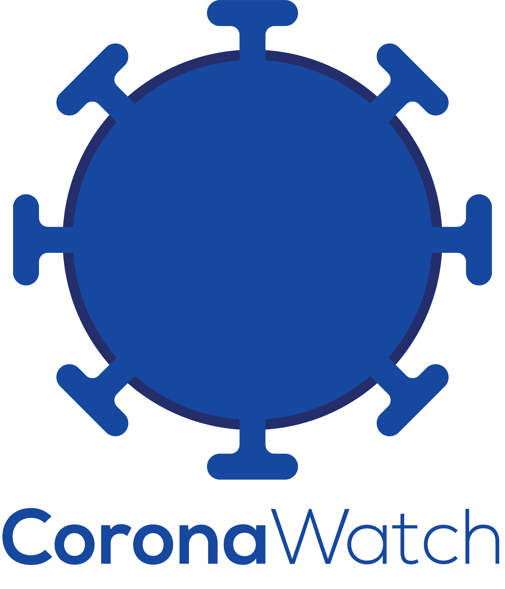

# CoronaWatch

A C# Application Project to track and watch Covid-19 cases worldwide, done to fulfill OOP Course final team assignments. Made with .NET Framework 4.8 and WPF.

# Team Members
* Agustina Asmoro Putri (19/439805/TK/48535)
* Ahmad Zidan (19/439806/TK/48536)
* Aldo Arya Saka Mukti (19/439807/TK/48537)